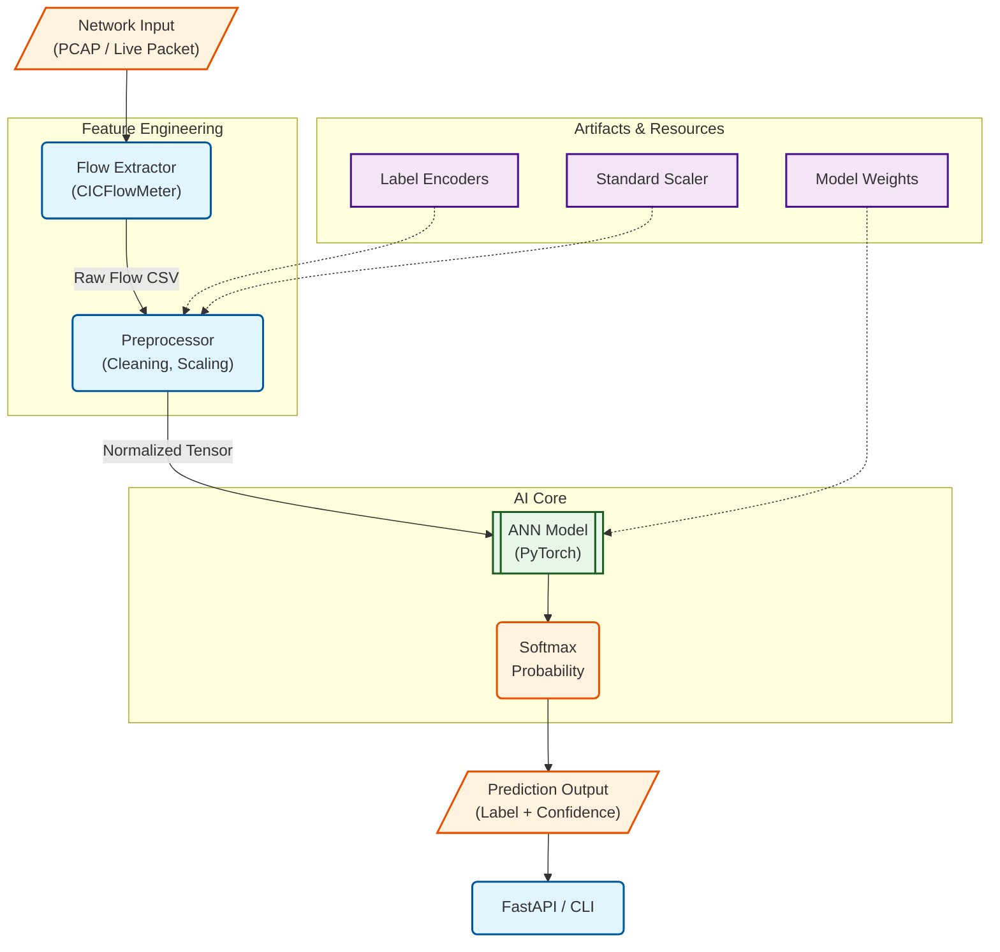
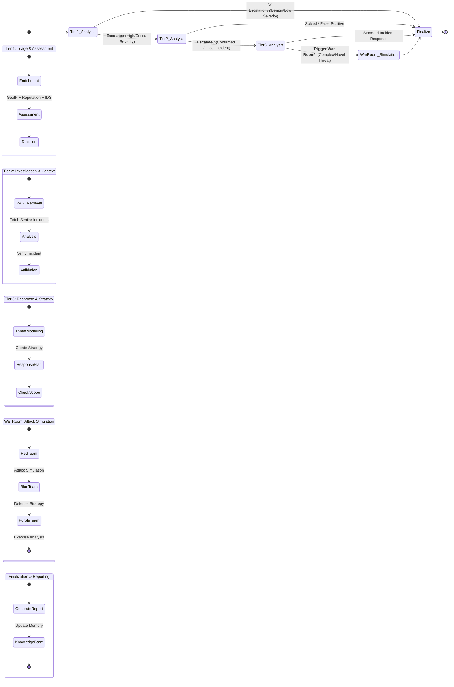

# System Architecture & Workflows

## 1. Intrusion Detection System (IDS) Architecture

This diagram illustrates the pipeline for processing network traffic through the AI-powered IDS.

## 2. Agentic SOC Workflow (Multi-Agent System)

This diagram represents the orchestration logic implemented in `SOCWorkflow.py` using LangGraph. It shows the hierarchical escalation process from automated triage to human-in-the-loop simulation.

